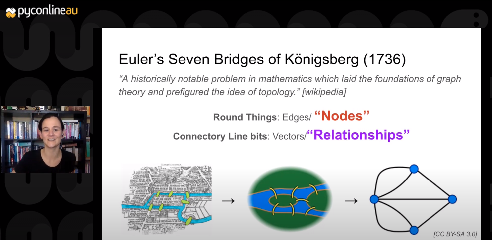

PyConlineAU 2020 Talk

# Graph Databases will Change Your Life

[Full talk on Youtube](https://www.youtube.com/watch?v=h8cyPIEfxQY&ab_channel=PyConAU):



[Link to video: PyConlineAU 2020: Graph Databases will Change Your Life](https://www.youtube.com/watch?v=h8cyPIEfxQY&ab_channel=PyConAU)


#### Canberra Python User Group is Super Rad!

Come join the [Canberra Python User Group (CPUG)](https://www.meetup.com/Canberra-Python-Meetup-Group/)

We also have a slack: [Canberra PUG slack](https://join.slack.com/t/canberrapug/shared_invite/zt-50v7p9g3-PnlGqMFr2LumH_dNizyWfg)


## CPUG Apr 2021 Slides used:

* [Slides Apr 2021](https://docs.google.com/presentation/d/e/2PACX-1vTVJ7WZng7ETgnpWGg4gUSP1WNSH0rNveQHkI3mdPzL_D8ccHLSep8qosj-yC7Vmnqz6oraIiTev3_-/pub?start=false&loop=false&delayms=3000)
* PDF: [GraphDB-talk_Elena-Williams_public+extra.pdf](GraphDB-talk_Elena-Williams_public+extra.pdf)

## PyConlineAU 2020 Demo Code used:

### Jupyter Notebook:

[notebook.ipynb](notebook.ipynb)

### Cypher Queries:

```cypher
// Create Python
CREATE (guido:Person {name: "Guido"})
CREATE (python:Language {name: "Python"})
CREATE (guido)-[:CREATED]->(python)
RETURN guido, python
```

Full set of examples here: [example.cypher](example.cypher)

Recommend:


```cypher
// Find the missing link

:params {person_name: "Cris"}

MATCH (subject:Person)
WHERE subject.name=$person_name


MATCH
     (dept:Department {name: "IT Department"})
     -[:WORKS_AT]-
     (people:Person)
     -[:LIKES]-
     (likeable_framework:Framework)
     -[:LANGUAGE]-
     (:Language {name: "Python"})

WHERE NOT (subject)-[:LIKES]->(likeable_framework)
RETURN likeable_framework
```

 .. and derp: [derp.cypher](derp.cypher)


Many thanks:
[@pyconau](https://twitter.com/pyconau),
[@nextdayvideo](https://twitter.com/nextdayvideo),
[@developerjack](https://twitter.com/developerjack),
[@jeamland](https://twitter.com/jeamland),
[@ExcitedLeigh](https://twitter.com/ExcitedLeigh),
[@kantrn](https://twitter.com/kantrn),
[@xfxf](https://twitter.com/xfxf)

and to all the python friends!


Thanks to Neo4j staff who have been amazingly kind, and let me re-use many of their great diagrams:
[Alicia Frame](https://medium.com/authority-magazine/female-disruptors-how-alicia-frame-of-neo4j-is-shaking-up-the-data-science-industry-4fd5ebd47cdf), [Max de Marzi](https://neo4j.com/blog/contributor/max-de-marzi/), our local person: [Joshua Yu](https://neo4j.com/blog/contributor/fanghua-yu/) and the wonderful [Karin Wolok](https://neo4j.com/blog/contributor/karin-wolok/).

[Full credits](credits.md)
