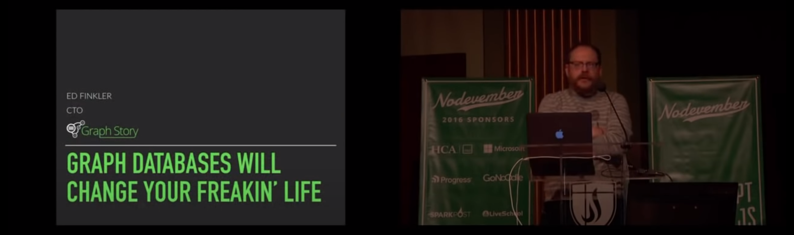

Full Credits:

[https://www.youtube.com/watch?v=GekQqFZm7mA](https://www.youtube.com/watch?v=GekQqFZm7mA)

(@funkatron)[http://twitter.com/funkatron](
Creative Commons Attribution-ShareAlike 4.0 International license)[https://creativecommons.org/licenses/by-sa/4.0/]

https://en.wikipedia.org/wiki/Seven_Bridges_of_K%C3%B6nigsberg

https://en.wikipedia.org/wiki/File:Konigsberg_bridges.png
(Creative Commons Attribution-Share Alike 3.0 Unported license)[https://creativecommons.org/licenses/by-sa/3.0/deed.en]

https://en.wikipedia.org/wiki/File:7_bridges.svg
(Creative Commons Attribution-Share Alike 3.0 Unported license)[https://creativecommons.org/licenses/by-sa/3.0/deed.en]

https://en.wikipedia.org/wiki/File:K%C3%B6nigsberg_graph.svg
(Creative Commons Attribution-Share Alike 3.0 Unported license)[https://creativecommons.org/licenses/by-sa/3.0/deed.en]

https://en.wikipedia.org/wiki/Ledger
https://en.wikipedia.org/wiki/Ledger#/media/File:Ledger.png (public domain)

Other images either generated by the author or used with permission of Neo4j staff <3
